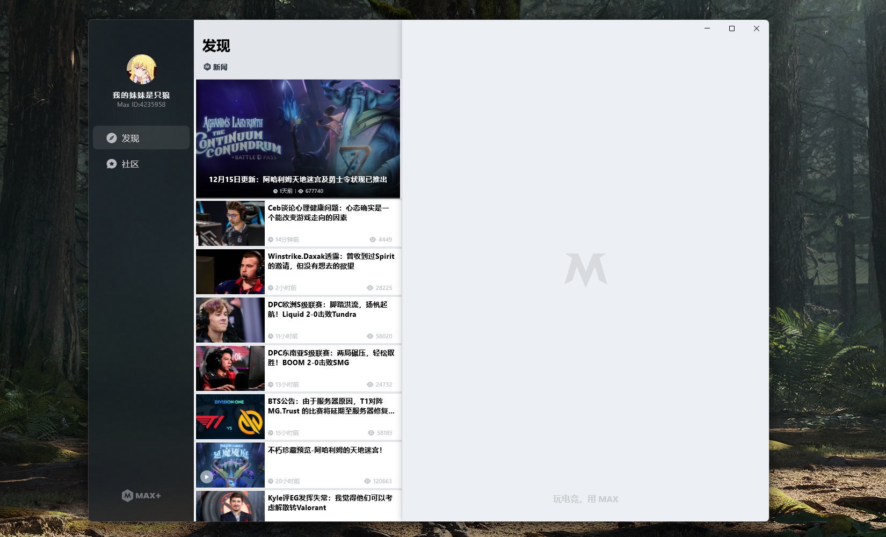

## <b>DotaMax-UWP</b>

Dota2 和 CS:GO 论坛 Max+ 的第三方 Win 10 客户端

这是一个第三方的应用程序，尚未完成，如果有任何建议或者侵犯了您的权益，烦请联系开发人员 yaoyiming123@live.com

### 截图

### 引用
| 名字 | 许可类型 | 项目网站 |
| --- | --- | --- |
| UWP Community Toolkit | [MIT License](https://github.com/Microsoft/UWPCommunityToolkit/blob/master/license.md) | [github.com/Microsoft/UWPCommunityToolkit ](https://github.com/Microsoft/UWPCommunityToolkit) |
| Microsoft.UI.Xaml | [MIT License](https://github.com/JamesNK/Newtonsoft.Json/blob/master/LICENSE.md) | [github.com/Microsoft/microsoft-ui-xaml](https://github.com/Microsoft/microsoft-ui-xaml) |
| Json.NET | [MIT License](https://github.com/JamesNK/Newtonsoft.Json/blob/master/LICENSE.md) | [newtonsoft.com](https://www.newtonsoft.com/json) |

2019-2020 ShockJockey.
